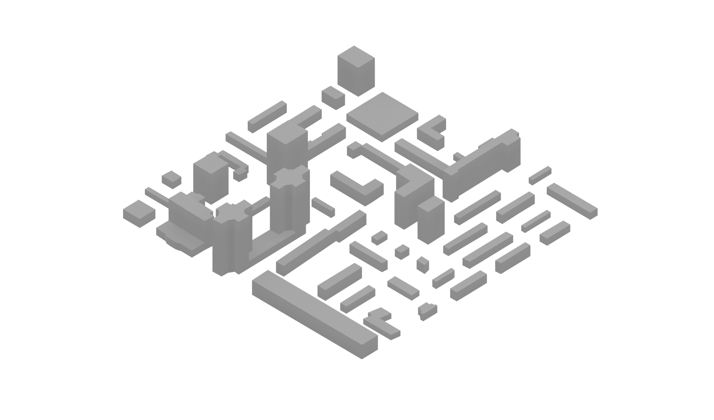

# Cityscape Generator

This repository contains code that procedurally generates 3D cityscape environments by packing randomized building models.

## Contents

The repository includes the following key components:

- `buildings/` - Folder containing raw 3D building STL models
- `tools/` - Python scripts for some useful tools
  - `match_scale.py` - Matches model scales between groups
- `building_model_preprocess.py` - Preprocesses building STL models
- `city_generator.py` - Generates cityscape scenes by packing models
- `requirements.txt` - Python package dependencies

## Usage

The overall workflow is:

1. Prepare building model library in `buildings/`
2. Run `building_model_preprocess.py` to standardize models
3. (Optional) Run `match_scale.py` to match the scale of different groups of models
4. Run `city_generator.py` to create cityscapes
5. Generated cityscapes are placed in `output/` (or any folder the user preferred)

Key parameters like city dimensions and building density can be configured in `city_generator.py`.

## Installation

Clone the repository:

```
git clone https://github.com/DreamCatcher096/random-city-generator.git
```

Install dependencies:

```
pip install -r requirements.txt
```

## Example Output

Here are some examples of generated cityscapes that were rendered with [Blender](https://www.blender.org/):




## TODO

Some ideas for future work:

- [ ] Make file paths configurable as parameters instead of hardcoded.

## Contributing

Contributions and ideas to improve this project are welcome! Feel free to open an issue or pull request if you would like to contribute.

Some ways you can help:

- Report bugs or desired features.
- Suggest optimizations or improvements.
- Fix issues with code or documentation.
- Help promote the project.

## Questions/Discussion

For any questions about this project or ideas for collaboration, please open a GitHub discussion. I'm excited to hear your thoughts on improving this project!

## Related Publications

An early version of this cityscape generator was used to create datasets in the following publication:

- Shao, X., Liu, Z., Zhang, S., Zhao, Z., & Hu, C. (2023). PIGNN-CFD: A physics-informed graph neural network for rapid predicting urban wind field defined on unstructured mesh. Building and Environment, 110056. https://doi.org/10.1016/j.buildenv.2023.110056

## Credits

The rectangle packing algorithm used in this project is provided by [Rectpack](https://github.com/secnot/rectpack).

## License

This project is licensed under the Apache-2.0 license. See [LICENSE](LICENSE) for details.
